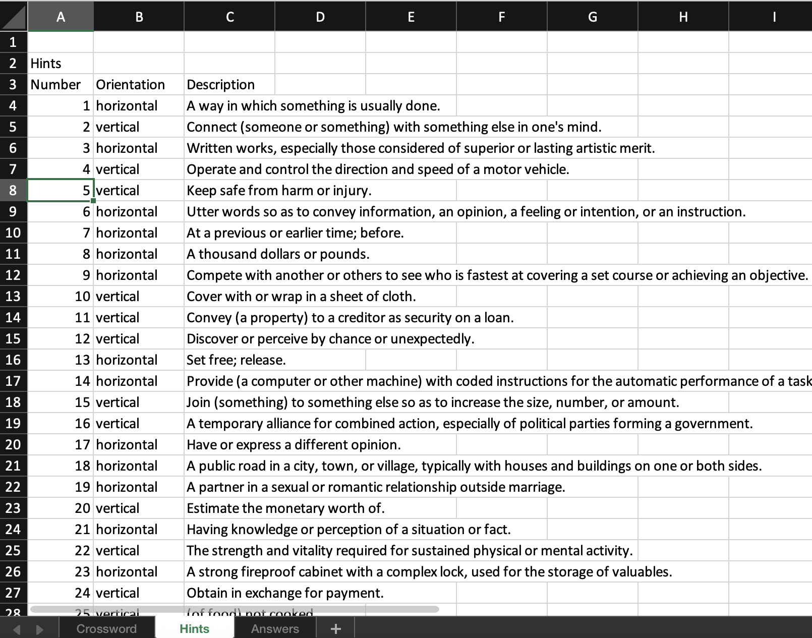

# Crossword Generator
Crossword Generator is an algorithm that creates a unique crossword each time it is executed. It randomly selects words, finds common characters within them and matches them to create a crossword. The crossword is then saved in a Microsoft Office Excel spreadsheet.




## Installation
*I recommend creating and using a virtual environment to run this application:*
```shell
python3 -m venv venv
source venv/bin/activate
```

You can then install the required dependencies using:
`pip install -r requirements.txt`

## Usage
* Run the python script from the top level directory using:
`python3 src/app.py`
* Press enter and wait for the crossword to be created.
* Open the newly created `Crossword.xlsx` file using Microsoft Office Excel compatible software and enjoy solving it!


